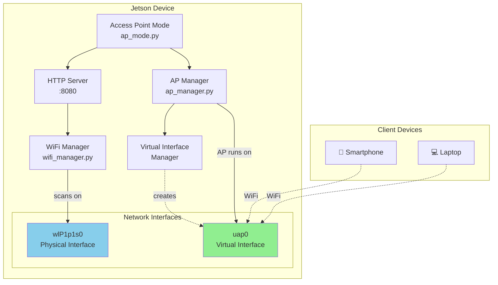

# Access Point Mode - Deployment Guide

## Tổng Quan

Hướng dẫn này sẽ giúp bạn setup và test Access Point mode trên Jetson, bao gồm cả tính năng Virtual Interface mới để scan WiFi mà không làm gián đoạn clients.

## Kiến Trúc Hệ Thống



---

## Prerequisites

### 1. Kiểm Tra WiFi Interface

```bash
# Kiểm tra WiFi interface có sẵn
nmcli device status

# Output mong đợi:
# DEVICE      TYPE      STATE         CONNECTION
# wlP1p1s0    wifi      disconnected  --
```

### 2. Kiểm Tra Hỗ Trợ Virtual Interface

```bash
# Kiểm tra card WiFi có hỗ trợ virtual interface không
iw list | grep -A 10 "valid interface combinations"
```

**Output mong đợi (nếu hỗ trợ):**

```
valid interface combinations:
     * #{ managed } <= 1, #{ AP } <= 1,
       total <= 2, #channels <= 1
```

> [!NOTE]
> Nếu không thấy output tương tự, card WiFi không hỗ trợ virtual interface. Hệ thống sẽ tự động fallback về physical interface (AP sẽ restart khi scan).

### 3. Cài Đặt Dependencies

```bash
cd /home/jetson/jetson_backend

# Cài đặt Python packages
pip3 install -r requirements.txt

# Kiểm tra NetworkManager
systemctl status NetworkManager
```

---

## Setup Instructions

### Bước 1: Copy Files Lên Jetson

```bash
# Từ máy Mac, copy toàn bộ jetson_backend lên Jetson
scp -r /Users/hieunt/Documents/project/scan_kit/jetson_backend jetson@<JETSON_IP>:/home/jetson/

# Hoặc nếu đã có folder, chỉ copy files mới
scp /Users/hieunt/Documents/project/scan_kit/jetson_backend/virtual_interface_manager.py jetson@<JETSON_IP>:/home/jetson/jetson_backend/
scp /Users/hieunt/Documents/project/scan_kit/jetson_backend/create_virtual_interface.sh jetson@<JETSON_IP>:/home/jetson/jetson_backend/
```

### Bước 2: SSH vào Jetson

```bash
ssh jetson@<JETSON_IP>
cd /home/jetson/jetson_backend
```

### Bước 3: Cấp Quyền Thực Thi

```bash
chmod +x create_virtual_interface.sh
chmod +x ap_mode.py
```

### Bước 4: Kiểm Tra Cấu Hình

Mở file `config.py` và kiểm tra:

```python
# WiFi Interface - ✅ Đã cập nhật cho thiết bị của bạn
WIFI_INTERFACE = "wlP1p1s0"

# AP Configuration
AP_SSID = "Jetson_Setup"
AP_PASSWORD = "jetson123"
AP_IP_ADDRESS = "192.168.4.1"

# Virtual Interface
USE_VIRTUAL_INTERFACE = True  # Bật virtual interface
PHYSICAL_INTERFACE_NAME = "wlP1p1s0"  # ✅ Đã cập nhật
```

---

## Testing Guide

### Test 1: Virtual Interface Manager

Kiểm tra xem có thể tạo virtual interface không.

```bash
sudo python3 virtual_interface_manager.py
```

**Output mong đợi:**

```
=== Virtual Interface Manager Test ===

[Test 1] Kiểm tra hỗ trợ virtual interface:
   ✓ Card WiFi hỗ trợ virtual interface (AP + Station)

[Test 2] Phát hiện phy device:
   PHY Device: phy0

[Test 3] Tạo virtual interface:
   ✓ Virtual interface uap0 đã được tạo thành công

[Test 4] Kiểm tra interface đã tạo:
   ✓ Interface tồn tại

[Test 5] Danh sách interfaces hiện tại:
phy#0
    Interface wlP1p1s0
        type managed
    Interface uap0
        type AP

Nhấn Enter để xóa interface...

[Test 6] Xóa virtual interface:
   ✓ Virtual interface uap0 đã được xóa

=== Test hoàn tất ===
```

> [!IMPORTANT]
> Nếu Test 3 thất bại với lỗi "Operation not supported", card WiFi không hỗ trợ virtual interface. Hệ thống sẽ tự động dùng physical interface.

---

### Test 2: Access Point Manager

Kiểm tra tạo và dừng Access Point.

```bash
sudo python3 ap_manager.py
```

**Output mong đợi:**

```
=== WiFi Access Point Manager Test ===

1. Phát hiện WiFi interface:
   Interface: wlP1p1s0

2. Tạo Access Point:
   INFO - Thử tạo virtual interface cho AP...
   INFO - Phát hiện phy device: phy0
   INFO - Virtual interface uap0 đã được tạo thành công
   INFO - Sử dụng virtual interface: uap0
   INFO - Đang tạo Access Point: SSID=Jetson_Setup, IP=192.168.4.1 trên uap0
   ✓ Access Point đã được tạo thành công

3. Kiểm tra status:
   Active: True
   SSID: Jetson_Setup
   IP: 192.168.4.1
   Interface: uap0

4. Chờ 5 giây...

5. Dừng Access Point:
   ✓ Access Point đã được dừng thành công

=== Test hoàn tất ===
```

**Kiểm tra từ smartphone:**

1. Mở WiFi settings trên điện thoại
2. Tìm mạng WiFi tên **"Jetson_Setup"**
3. Kết nối với password: **jetson123**
4. Kiểm tra IP đã nhận (nên là 192.168.4.x)

---

### Test 3: AP Mode Full Workflow

Chạy AP mode đầy đủ với HTTP server.

```bash
sudo python3 ap_mode.py
```

**Output mong đợi:**

```
=== Jetson OOBE - Access Point Mode ===

[INFO] Kiểm tra điều kiện khởi động AP mode...
[INFO] ✓ Không có kết nối WiFi - cần thiết lập
[INFO] Khởi động AP mode...
[INFO] Thử tạo virtual interface cho AP...
[INFO] Virtual interface uap0 đã được tạo thành công
[INFO] Sử dụng virtual interface: uap0
[INFO] Access Point đã được tạo thành công: SSID=Jetson_Setup
[INFO] Khởi động HTTP server trên 192.168.4.1:8080...
[INFO] HTTP Server đang chạy...

=== AP Mode đang hoạt động ===
SSID: Jetson_Setup
Password: jetson123
IP: 192.168.4.1
Web Interface: http://192.168.4.1:8080

Nhấn Ctrl+C để dừng...
```

**Kiểm tra từ smartphone:**

1. Kết nối vào WiFi "Jetson_Setup"
2. Mở browser, truy cập: `http://192.168.4.1:8080`
3. Kiểm tra các API endpoints:
   - `GET /api/status` - Trạng thái hệ thống
   - `GET /api/scan` - Scan WiFi networks
   - `POST /api/connect` - Kết nối WiFi

---

### Test 4: WiFi Scan Trong Khi AP Chạy

**Mục tiêu:** Kiểm tra clients không bị disconnect khi scan WiFi.

**Terminal 1 (Jetson):** Chạy AP mode

```bash
sudo python3 ap_mode.py
```

**Smartphone:** Kết nối vào WiFi "Jetson_Setup"

**Terminal 2 (Jetson):** SSH vào Jetson và scan WiFi

```bash
ssh jetson@<JETSON_IP>
cd /home/jetson/jetson_backend

# Scan WiFi trên physical interface
python3 -c "from wifi_manager import scan_wifi_networks; import json; print(json.dumps(scan_wifi_networks('wlP1p1s0'), indent=2))"
```

**Output mong đợi:**

```json
[
  {
    "ssid": "MyHomeWiFi",
    "signal": 85,
    "security": "WPA2"
  },
  {
    "ssid": "NeighborWiFi",
    "signal": 45,
    "security": "WPA2"
  }
]
```

**Kiểm tra trên smartphone:**
- ✅ Vẫn kết nối WiFi "Jetson_Setup"
- ✅ Không bị disconnect
- ✅ Có thể ping 192.168.4.1

> [!TIP]
> **Với virtual interface:** Clients không bị disconnect  
> **Không có virtual interface:** Clients sẽ bị disconnect 5-10 giây khi scan

---

### Test 5: HTTP API Endpoints

Test các API endpoints của HTTP server.

**Khởi động AP mode:**

```bash
sudo python3 ap_mode.py
```

**Từ smartphone hoặc laptop đã kết nối:**

#### 1. Kiểm tra status

```bash
curl http://192.168.4.1:8080/api/status
```

**Response:**

```json
{
  "status": "ok",
  "mode": "ap",
  "ap_active": true,
  "wifi_connected": false
}
```

#### 2. Scan WiFi networks

```bash
curl http://192.168.4.1:8080/api/scan
```

**Response:**

```json
{
  "status": "success",
  "networks": [
    {
      "ssid": "MyHomeWiFi",
      "signal": 85,
      "security": "WPA2"
    }
  ]
}
```

#### 3. Kết nối WiFi

```bash
curl -X POST http://192.168.4.1:8080/api/connect \
  -H "Content-Type: application/json" \
  -d '{
    "ssid": "MyHomeWiFi",
    "password": "mypassword"
  }'
```

**Response:**

```json
{
  "status": "success",
  "message": "Kết nối thành công đến MyHomeWiFi"
}
```

---

## Troubleshooting

### Lỗi 1: "No such device" khi tạo virtual interface

**Nguyên nhân:** Interface name sai hoặc không tồn tại.

**Giải pháp:**

```bash
# Kiểm tra tên interface thực tế
nmcli device status
iw dev

# Cập nhật config.py với tên đúng
# Thiết bị của bạn đã đúng: wlP1p1s0
```

---

### Lỗi 2: "Operation not supported" khi tạo virtual interface

**Nguyên nhân:** Card WiFi không hỗ trợ virtual interface.

**Giải pháp:** Hệ thống tự động fallback. Hoặc tắt thủ công:

```python
# Trong config.py
USE_VIRTUAL_INTERFACE = False
```

Hoặc khi gọi hàm:

```python
create_access_point(use_virtual_interface=False)
```

---

### Lỗi 3: "Connection activation failed" khi tạo AP

**Nguyên nhân:** NetworkManager đang quản lý interface.

**Giải pháp:**

```bash
# Kiểm tra connections hiện tại
nmcli connection show

# Xóa connection cũ nếu có
sudo nmcli connection delete Jetson_OOBE_AP

# Thử lại
sudo python3 ap_mode.py
```

---

### Lỗi 4: Không thể kết nối vào AP từ smartphone

**Kiểm tra:**

1. **AP có đang chạy không?**
   ```bash
   nmcli connection show --active | grep Jetson_OOBE_AP
   ```

2. **Interface có đúng không?**
   ```bash
   iw dev
   # Nên thấy uap0 hoặc wlP1p1s0 với type AP
   ```

3. **Firewall có chặn không?**
   ```bash
   sudo ufw status
   # Nếu active, cho phép port 8080
   sudo ufw allow 8080/tcp
   ```

4. **DHCP server có chạy không?**
   ```bash
   # Kiểm tra dnsmasq process
   ps aux | grep dnsmasq
   ```

---

### Lỗi 5: Clients bị disconnect khi scan WiFi

**Nguyên nhân:** Virtual interface không hoạt động, đang dùng physical interface.

**Kiểm tra:**

```bash
# Xem AP đang chạy trên interface nào
nmcli connection show --active | grep Jetson_OOBE_AP

# Nếu thấy wlP1p1s0 thay vì uap0, virtual interface không hoạt động
```

**Giải pháp:**

```bash
# Kiểm tra lại hỗ trợ virtual interface
iw list | grep -A 10 "valid interface combinations"

# Nếu không hỗ trợ, đây là hành vi bình thường
# Cân nhắc sử dụng USB WiFi adapter thứ 2
```

---

## Production Deployment

### Tạo Systemd Service

Để AP mode tự động chạy khi boot.

**1. Tạo service file:**

```bash
sudo nano /etc/systemd/system/jetson-ap.service
```

**Nội dung:**

```ini
[Unit]
Description=Jetson Access Point Mode
After=network.target NetworkManager.service
Wants=NetworkManager.service

[Service]
Type=simple
User=root
WorkingDirectory=/home/jetson/jetson_backend
ExecStart=/usr/bin/python3 /home/jetson/jetson_backend/ap_mode.py
Restart=on-failure
RestartSec=10
StandardOutput=journal
StandardError=journal

[Install]
WantedBy=multi-user.target
```

**2. Kích hoạt service:**

```bash
# Reload systemd
sudo systemctl daemon-reload

# Enable service (tự động chạy khi boot)
sudo systemctl enable jetson-ap.service

# Start service ngay
sudo systemctl start jetson-ap.service

# Kiểm tra status
sudo systemctl status jetson-ap.service
```

**3. Xem logs:**

```bash
# Xem logs real-time
sudo journalctl -u jetson-ap.service -f

# Xem logs từ lần boot cuối
sudo journalctl -u jetson-ap.service -b
```

---

### Tạo Virtual Interface Service (Optional)

Nếu muốn virtual interface persistent qua reboot.

**1. Tạo service file:**

```bash
sudo nano /etc/systemd/system/create-virtual-ap.service
```

**Nội dung:**

```ini
[Unit]
Description=Create Virtual Interface for Access Point
After=network.target
Before=jetson-ap.service

[Service]
Type=oneshot
ExecStart=/home/jetson/jetson_backend/create_virtual_interface.sh
RemainAfterExit=yes

[Install]
WantedBy=multi-user.target
```

**2. Kích hoạt:**

```bash
sudo systemctl enable create-virtual-ap.service
sudo systemctl start create-virtual-ap.service
```

---

## Performance Monitoring

### Kiểm Tra Resource Usage

```bash
# CPU và Memory
top -p $(pgrep -f ap_mode.py)

# Network traffic
sudo iftop -i uap0

# WiFi signal quality
watch -n 1 'iw dev uap0 station dump'
```

### Kiểm Tra Clients Đang Kết Nối

```bash
# Xem clients kết nối vào AP
iw dev uap0 station dump

# Hoặc dùng arp
arp -a | grep 192.168.4
```

---

## Quick Reference

### Các Lệnh Thường Dùng

```bash
# Khởi động AP mode
sudo python3 ap_mode.py

# Dừng AP mode
# Nhấn Ctrl+C trong terminal đang chạy

# Kiểm tra AP status
nmcli connection show --active | grep Jetson_OOBE_AP

# Xem interfaces
iw dev

# Scan WiFi (chỉ định interface wlP1p1s0)
python3 -c "from wifi_manager import scan_wifi_networks; print(scan_wifi_networks('wlP1p1s0'))"

# Test virtual interface
sudo python3 virtual_interface_manager.py

# Xem logs (nếu dùng systemd)
sudo journalctl -u jetson-ap.service -f
```

### Các Files Quan Trọng

| File | Mô tả |
|------|-------|
| `ap_mode.py` | Entry point - khởi động AP mode |
| `ap_manager.py` | Quản lý Access Point |
| `wifi_manager.py` | Quản lý WiFi scanning và kết nối |
| `virtual_interface_manager.py` | Quản lý virtual interface |
| `http_server.py` | HTTP REST API server |
| `config.py` | Cấu hình hệ thống |

### Cấu Hình Mặc Định

| Tham số | Giá trị |
|---------|---------|
| AP SSID | Jetson_Setup |
| AP Password | jetson123 |
| AP IP | 192.168.4.1 |
| HTTP Port | 8080 |
| Virtual Interface | uap0 |
| Physical Interface | wlP1p1s0 ✅ |
| Auto Shutdown | 30 phút |

---

## Next Steps

Sau khi test thành công AP mode:

1. ✅ Tích hợp với web interface (React app)
2. ✅ Setup systemd service cho production
3. ✅ Test trên nhiều loại devices
4. ✅ Cấu hình firewall rules
5. ✅ Setup monitoring và logging

---

## Support

Nếu gặp vấn đề:

1. Kiểm tra logs: `sudo journalctl -u jetson-ap.service -f`
2. Xem troubleshooting section ở trên
3. Kiểm tra interface name: `nmcli device status` (phải là `wlP1p1s0`)
4. Test virtual interface: `sudo python3 virtual_interface_manager.py`

---

**Last Updated:** 2026-02-04  
**Version:** 1.0 (with Virtual Interface support)  
**Device:** Jetson with wlP1p1s0 interface
