# セットアップガイド

AIVISカメラデバイスのセットアップは3つのメインフェーズ（+ オプション1つ）で構成されます：

| フェーズ | 内容 | 実施場所 |
|---------|------|---------|
| [Phase 1](#phase-1-aivis-adminでカメラを作成) | AIVIS Adminでカメラレコードを作成 | AIVIS Admin Web |
| [Phase 2](#phase-2-cloudflareトンネルを作成) | Cloudflare Tunnelを作成し、ドメイン/トークンを更新 | Cloudflare Dashboard + AIVIS Admin |
| [Phase 3](#phase-3-jetsonデバイスのインストールと設定) | Jetsonにソフトウェアをインストール | Jetson Orin Nano（直接操作） |
| [Phase 4](#phase-4-イメージのクローン必要な場合) *(任意)* | NVMeを再利用可能なゴールデンイメージにクローン | Jetson Orin Nano |

---

## Phase 1: AIVIS Adminでカメラを作成

### 事前準備

- イメージのダウンロードリンク、バックエンドドメイン、デフォルトアカウント情報などはプロジェクトシートに記載されています。アクセス権がない場合はプロジェクトマネージャーに連絡してください。
- Jetson Orin NanoのSerial Number（デバイス底面のラベルに記載）

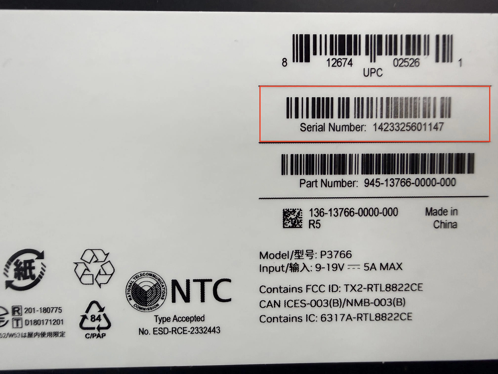

### 手順

**ステップ1.** AIVIS Adminにログイン

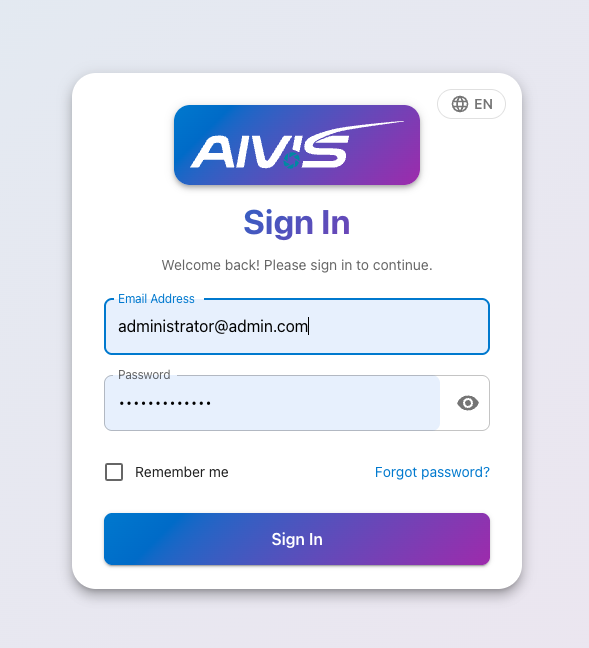

**ステップ2.** **Cameras**メニュー > **+ Add New Camera**をクリック

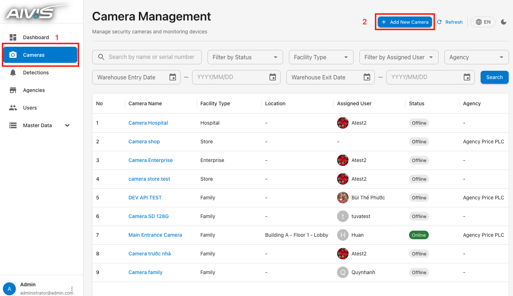

**ステップ3.** カメラ情報を入力

1. **Camera Name**と**Serial Number**（Jetsonのラベルから取得）を入力
2. **Create**をクリック

> その他のフィールド（Installation Location、Domain Name、Cloudflare Tunnel Token、Facility Type、...）は後で入力可能です。

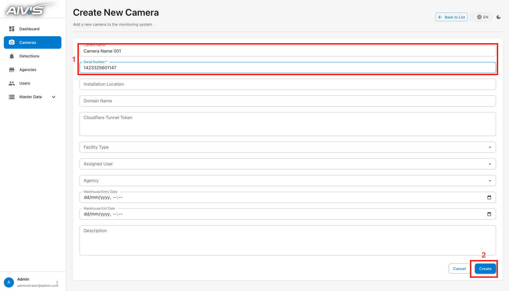

**ステップ4.** Device Infoを取得

作成後、カメラ詳細ページ > **Device Info**をクリック。ポップアップに[Phase 3](#phase-3-jetsonデバイスのインストールと設定)で必要な3つの情報が表示されます：

- **Device ID** — カメラのUUID
- **Backend URL** — APIバックエンドURL
- **Secret Key** — 認証用HMAC署名キー

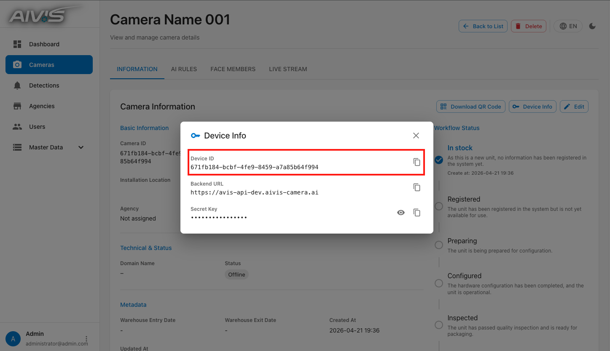

> 各フィールド横のコピーアイコンをクリックして値をコピーします。

---

## Phase 2: Cloudflareトンネルを作成

Cloudflare Tunnelにより、バックエンドがパブリックIPやポートフォワーディングなしでJetsonデバイスにリモートアクセス（OTAアップデート、ライブストリーム、SSH）できます。

> イメージのダウンロードリンク、バックエンドドメイン、デフォルトアカウント情報などはプロジェクトシートに記載されています。アクセス権がない場合はプロジェクトマネージャーに連絡してください。

各カメラには**1つのトンネル**と**2つのPublic Hostname**が必要です：
- `{device-id}.aivis-camera.ai` — HTTPアクセス（ストリーム、API、OTA）
- `{device-id}-ssh.aivis-camera.ai` — SSHアクセス

### 手順

**ステップ1.** [Cloudflare Dashboard](https://dash.cloudflare.com)にログイン

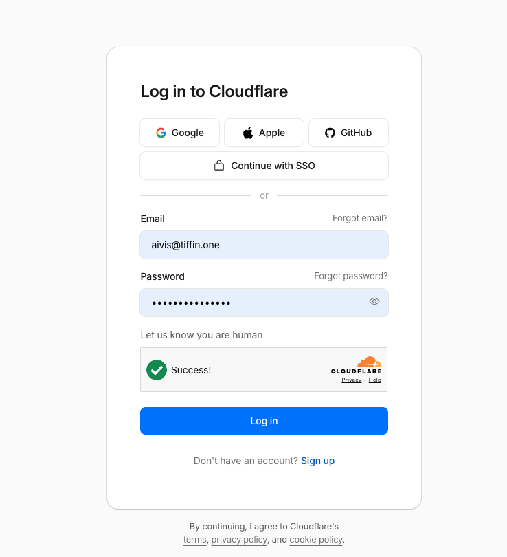

**ステップ2.** 左サイドバーで**Zero Trust**を選択

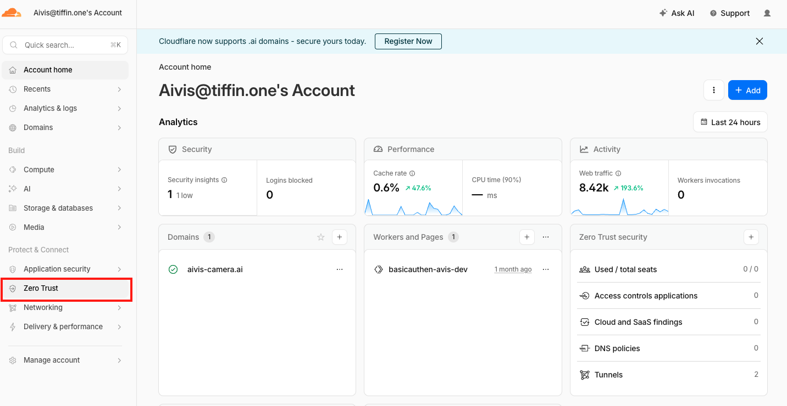

**ステップ3.** **Connectors** > **Cloudflare Tunnels** > **Create a tunnel**をクリック

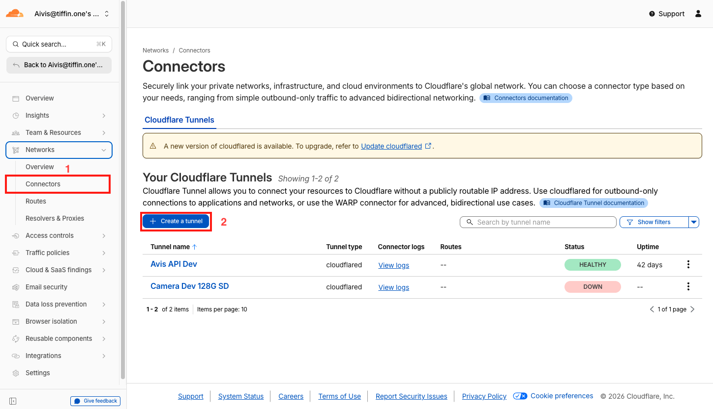

**ステップ4.** **Cloudflared**を選択 > **Select Cloudflared**をクリック

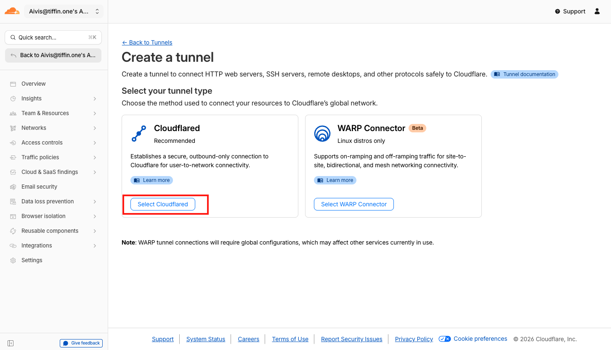

**ステップ5.** トンネル名を設定

1. トンネル名を`Camera {device-id}`の形式で入力（例：`Camera 671fb184-bcbf-4fe9-8459-a7a85b64f994`）
2. **Save tunnel**をクリック

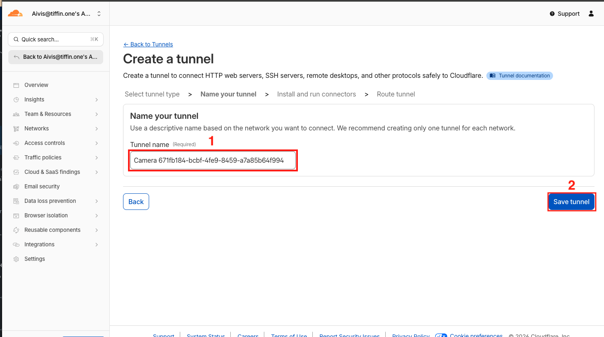

**ステップ6.** "Install and run a connector"ページをスキップ > **Next**をクリック

> このステップではインストールコマンドを実行する必要はありません。CloudflaredはJetson上で`install-software.sh`により自動インストールされます。

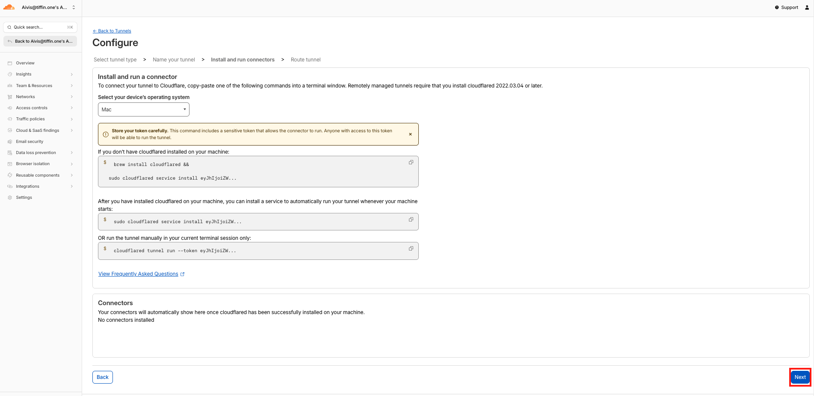

**ステップ7.** **HTTP**（ストリーム/API）用のPublic Hostnameを追加

1. **Subdomain**: `{device-id}`（例：`671fb184-bcbf-4fe9-8459-a7a85b64f994`）
2. **Domain**: `aivis-camera.ai`
3. **Type**: `HTTP`
4. **URL**: `localhost`
5. **Complete setup**をクリック

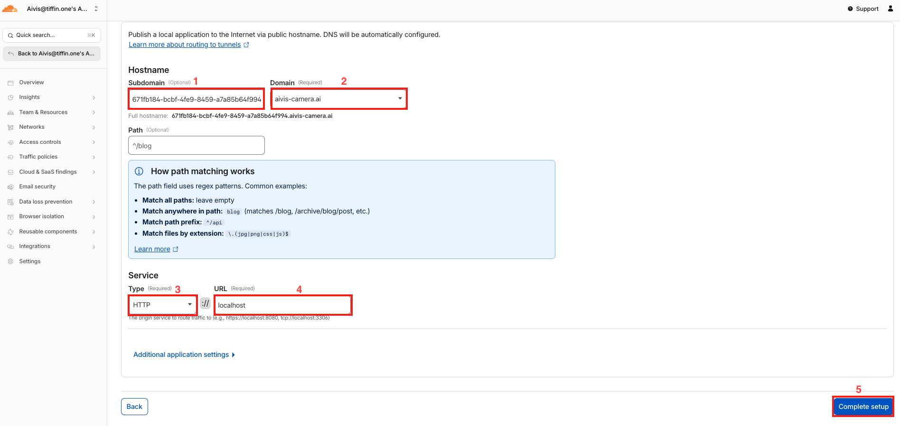

**ステップ8.** トンネル一覧に戻る > 作成したトンネルの**Configure**をクリック

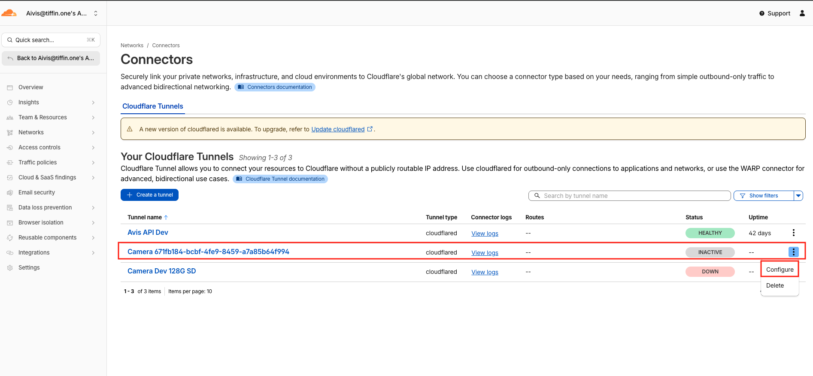

**ステップ9.** **Published application routes**タブを選択 > **+ Add a published application route**をクリック

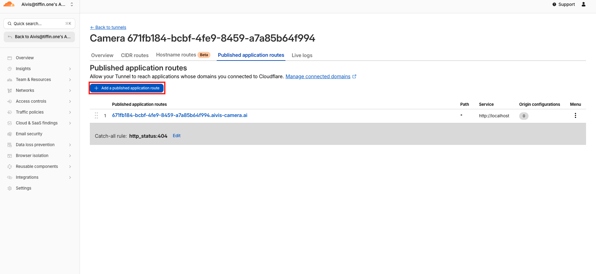

**ステップ10.** **SSH**用のPublic Hostnameを追加

1. **Subdomain**: `{device-id}-ssh`（例：`671fb184-bcbf-4fe9-8459-a7a85b64f994-ssh`）
2. **Domain**: `aivis-camera.ai`
3. **Type**: `SSH`
4. **URL**: `localhost:22`
5. **Save**をクリック

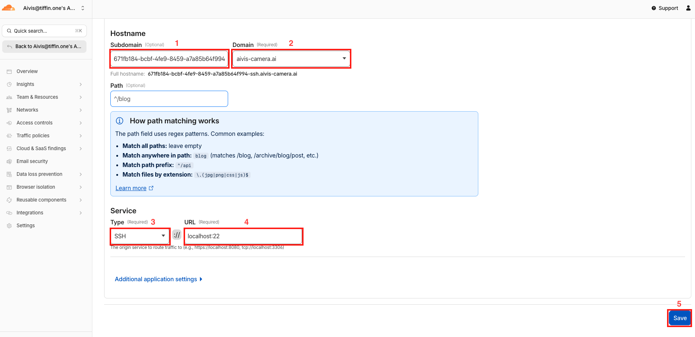

**ステップ11.** **Overview**タブを選択 > **Connectors**セクションで**Add a connector**をクリック

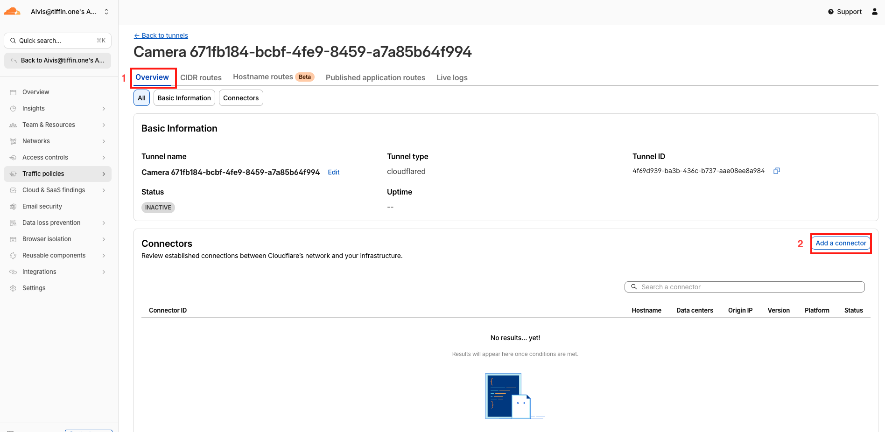

**ステップ12.** **Tunnel Token**をコピー

"Install and run a connector"ポップアップで、コマンド`cloudflared tunnel run --token eyJhI...`からトークンをコピー

> トークン部分（`eyJ...`で始まる）のみをコピーしてください。コマンド全体ではありません。

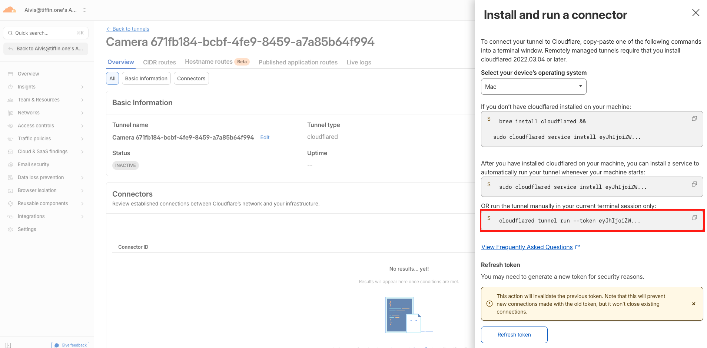

**ステップ13.** AIVIS Adminに戻る > カメラ詳細ページ > **Edit**をクリック

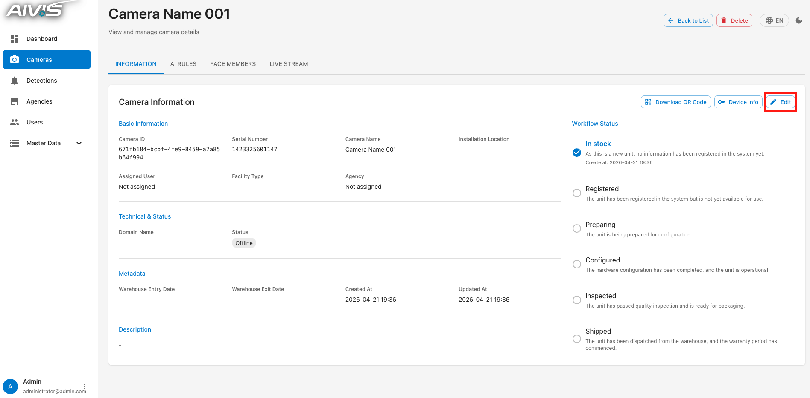

**ステップ14.** **Domain Name**と**Cloudflare Tunnel Token**フィールド横のロックアイコンをクリックして編集を有効化

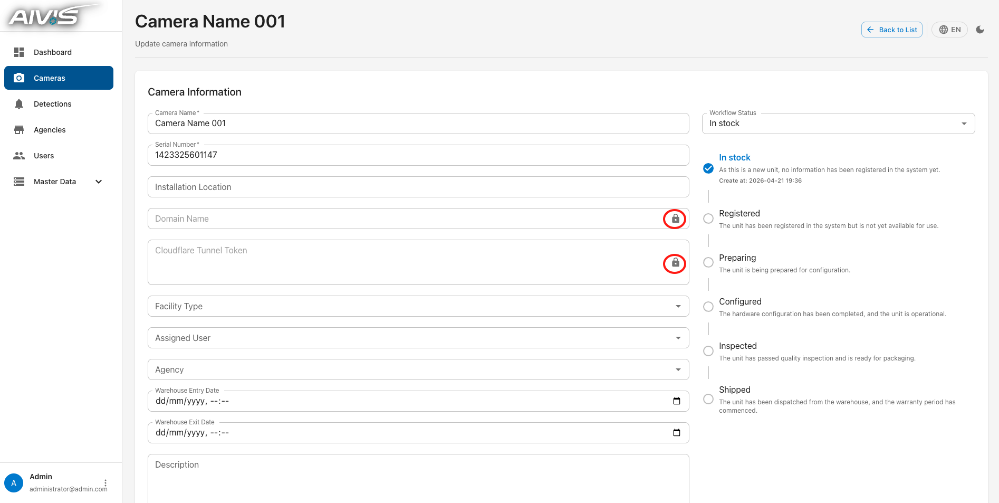

**ステップ15.** Domain NameとTunnel Tokenを入力

1. **Domain Name**: CloudflareのPublished application routesタブからコピー（HTTPホスト名、例：`671fb184-bcbf-4fe9-8459-a7a85b64f994.aivis-camera.ai`）

   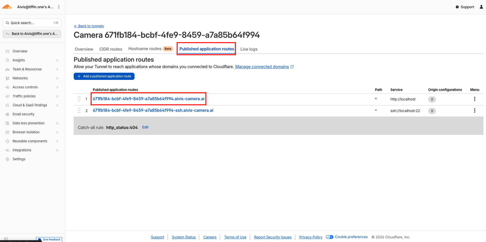

2. **Cloudflare Tunnel Token**: ステップ12でコピーしたトークンを貼り付け
3. **Save**をクリック

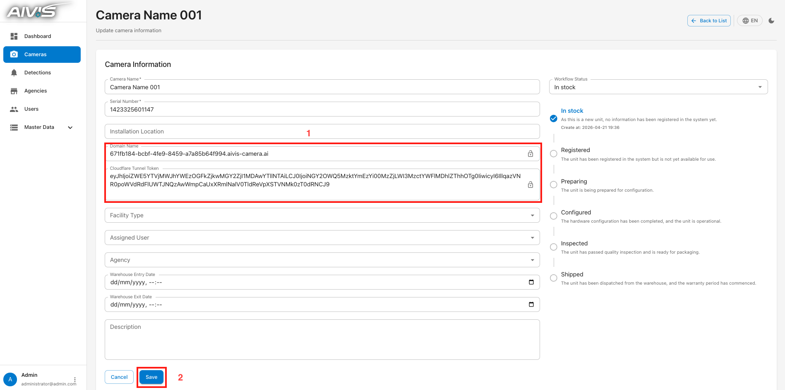

---

## Phase 3: Jetsonデバイスのインストールと設定

### 必要なもの

- NVMe SSD 256GB（新品またはフォーマット済み）
- システムイメージファイル（ダウンロードリンクはプロジェクトシートを参照）
- SSD書き込みアダプタ（USB-to-NVMeまたはM.2スロット搭載PC）
- [Phase 1 - ステップ4](#手順)のDevice Info：Device ID、Backend URL、Secret Key

### 手順

**ステップ1.** システムイメージをダウンロード

以下のリンクからシステムイメージをダウンロードします：

[jetson-base.img.gz](https://dehasoftvn-my.sharepoint.com/:u:/r/personal/administrator_deha-soft_com/Documents/DEHA%20group/02.%20BOM/02.%20Head%20Office/01.%20JMU/05.%20JMU%20-%20Projects%20(B%E1%BA%A3o%20m%E1%BA%ADt)/TIMIMA01/05%20-%20Release/%E7%B4%8D%E5%93%81%E7%89%A9/Jetson%20Orin%20Nano%E7%94%A8%20%E3%82%BB%E3%83%83%E3%83%88%E3%82%A2%E3%83%83%E3%83%97%E3%83%95%E3%82%A1%E3%82%A4%E3%83%AB/jetson-base.img.gz?csf=1&web=1&e=kbVSfc)

> 上記リンクにアクセスできない場合はプロジェクトマネージャーに連絡してください。

**ステップ2.** イメージをSSDに書き込み

アダプタ経由でSSDをPCに接続し、イメージを書き込みます：

```bash
# 圧縮ファイル（.img.gz）から
pigz -dc jetson-base.img.gz | sudo dd of=/dev/<ssd-device> bs=4M status=progress
```

> `<ssd-device>`は実際のSSDデバイス名に置き換えてください（例：`sda`、`nvme0n1`）。書き込み前に`lsblk`で確認してください。

**ステップ3.** ハードウェアの組み立て

SSDをJetson Orin Nanoに挿入し、すべての周辺機器を接続します：

| デバイス | 接続先 |
|---------|--------|
| NVMe SSD 256GB | ボード上のM.2スロット |
| CSIカメラ（IMX219） | リボンケーブルでCSIポート |
| USBマイク/スピーカー | USBポート |
| SIM7600 LTEモジュール | USBポート（4G必要時） |
| 電源（9-19V 5A） | DCバレルジャック |
| LANケーブル（初期セットアップ推奨） | Ethernetポート |
| モニター（HDMI） | HDMIポート（初期セットアップに必要） |
| USBキーボード | USBポート（初期セットアップに必要） |

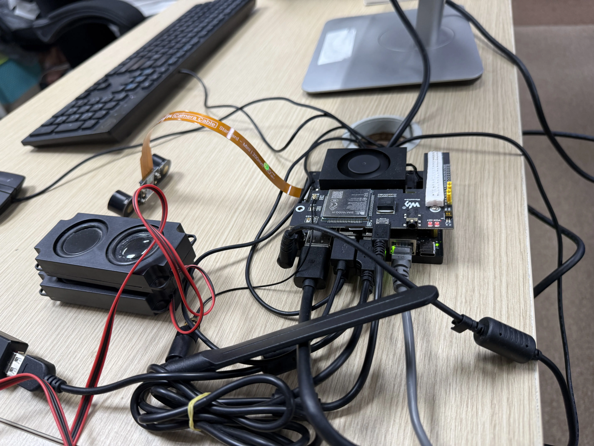

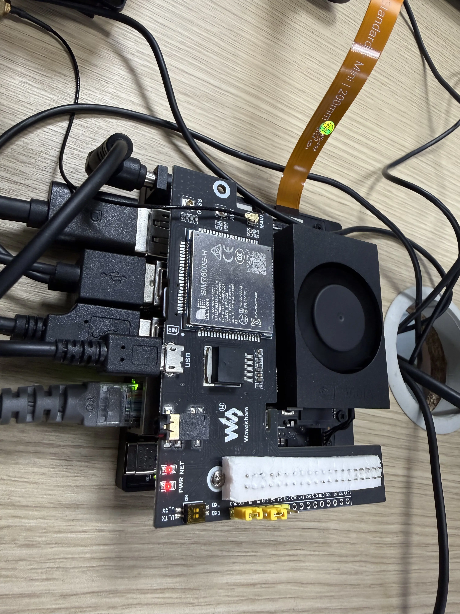

> モニターとキーボードは初期セットアップ時のみ必要です。セットアップ完了後は取り外し、SSH経由でリモート管理できます。

**ステップ4.** 電源投入と直接ログイン

Jetsonに電源を入れ、起動完了まで約1〜2分待ちます。接続したモニターで直接ログインします：

```
avis-cam login: avis
Password: 1
```

> 新しいデバイスはネットワーク接続がないため、SSHは使用できません。モニター + キーボードで直接操作する必要があります。

**ステップ5.** ネットワーク接続（マスターセットアップ前に必須）

クローンイメージにはWiFi認証情報が含まれていないため、新しくフラッシュしたデバイスにはインターネット接続がありません。Cloudflaredはトンネル初期化のためインターネットを必要とします — このステップをスキップすると `cloudflared.service` が失敗状態になります。

**方法1 — LANケーブル接続**（最も簡単）：イーサネットケーブルを接続するだけで、ネットワークは自動的に設定されます。残りはスキップしてステップ6へ。

**方法2 — GUIからWiFi接続**（ステップ3でモニターとキーボードを既に接続済み）：

1. 画面右上のネットワークアイコン（Network Manager）をクリック
2. 接続したいWiFiのSSIDを選択し、パスワードを入力
3. アイコンが接続済み表示になるまで待つ
4. ターミナルを開き（`Ctrl + Alt + T`）、WiFiを優先インターフェースに設定するコマンドを実行：

   ```bash
   sudo bash /opt/4g/switch-network.sh wifi
   ```

**方法3 — 4G利用**（SIM7600モジュール装着＋SIM挿入時のみ）：

```bash
sudo bash /opt/4g/switch-network.sh 4g
```

インターネット接続を確認：

```bash
ping -c 3 8.8.8.8
```

ping成功を確認したらステップ6へ。

**ステップ6.** マスターセットアップを実行

```bash
sudo bash mini-pc/setup-firstboot/master-setup.sh --prompt-device-env --restart-all
```

rootパスワード（`1`）を入力後、スクリプトが3つの情報を要求します（[Phase 1 - ステップ4](#手順)から取得）：

```
DEVICE_ID: 671fb184-bcbf-4fe9-8459-a7a85b64f994
BACKEND_URL: https://avis-api-dev.aivis-camera.ai
SECRET_KEY (hidden): ••••••••••
```

スクリプトが自動的に実行：
1. **install-software.sh** — パッケージ、スワップ、go2rtc、cloudflaredをインストール
2. **setup-services.sh --restart-all** — ファイルをデプロイし、すべてのサービスを有効化・再起動

**ステップ7.** ステータス確認

```bash
sudo bash mini-pc/setup-firstboot/scripts/check-status.sh
```

期待される結果 — すべてのサービスが**active**で、ハードウェアが検出されていること：

```
━━━ Services ━━━
  ✓  camera-stream         active      (enabled)
  ✓  go2rtc                active      (enabled)
  ✓  ai-core               active      (enabled)
  ✓  logic-service         active      (enabled)
  ✓  oobe-setup            active      (enabled)
  ✓  backchannel           active      (enabled)
  ✓  person-count-ws       active      (enabled)
  ✓  stream-auth           active      (enabled)
  ✓  device-update-server  active      (enabled)
  ✓  nginx                 active      (enabled)
  ✓  sim7600-4g            active      (enabled)
  ✓  network-watchdog      active      (enabled)
  ✓  cloudflared           active      (enabled)
  ✓  audio-autostart [user]  active      (enabled)

━━━ Cron Jobs ━━━
  ✓  sync-config.py             (*/5 * * * *, root)
  ✓  device-update.py           (*/5 * * * *, root)

━━━ CSI Camera ━━━
  ✓  nvargus-daemon          active
  ✓  video devices           /dev/video0
  ✓  AI shared memory        12441664 bytes

━━━ USB Audio ━━━
  ✓  PulseAudio              running
  ✓  Speaker                 alsa_output.usb-...-00.iec958-stereo (SUSPENDED)
  ✓  Microphone              alsa_input.usb-...-00.analog-stereo (RUNNING)
  ✓  Echo Cancel             loaded (module ...)
      echocancel_sink: SUSPENDED, echocancel_source: RUNNING

━━━ LTE Module (SIM7600) ━━━
  ✓  USB serial              /dev/ttyUSB0,...
  ✓  USB device              Bus 001 Device 006: ID 1e0e:9011 ...
  ✓  4G interface            usb2 — 169.254.x.x/16

━━━ Network ━━━
  Mode: auto
  ✓  wlP1p1s0               192.168.x.x/24
  Default route: default via 192.168.x.1 dev wlP1p1s0

━━━ Device Info ━━━
  Device ID:    671fb184-bcbf-4fe9-8459-a7a85b64f994
  Backend URL:  https://avis-api-dev.aivis-camera.ai
```

**ステップ8.** パスワードを変更

すべてが正常に動作していることを確認後、デフォルトパスワードを**必ず**変更してください：

```bash
passwd
```

> 新しいパスワードをDevice IDとともにデバイス管理ファイル（プロジェクトシートまたはパスワードマネージャー）に保存し、必要時にSSHでリモートアクセスできるようにしてください。

### 完了確認

セットアップが正常に完了した場合：

- `sync-config.py`が5分ごとにバックエンドから設定を自動同期
- `device-update.py`が5分ごとにハートビート（ソフトウェアバージョン）を送信
- AIVIS Admin上のカメラステータスが**Online**に変更
- ライブストリームにアクセス可能：`https://{device-id}.aivis-camera.ai`

---

## Phase 4: イメージのクローン（必要な場合）

完全に設定済みのJetsonから「ゴールデンイメージ」を作成し、他のデバイスへ書き込んで再利用する場合にこのフェーズを使用します。デバイス固有のIDや状態を消去し、空き領域をゼロ埋めして（`pigz`の圧縮率を高めるため）、NVMeを外付けUSB SSD上の圧縮ファイルにクローンします。

> すべてのコマンドはJetson上で直接実行します（モニター + キーボードまたはSSH経由）。すべての手順で`sudo`が必要です。

### 必要なもの

- 圧縮イメージを保存できる十分な容量のUSB SSD（256GB以上推奨）
- クローン対象のNVMeから起動済みのJetson
- セットアップが完了済み（`check-status.sh`ですべて正常）

### 手順

**ステップ1.** すべてのサービスを停止

```bash
sudo systemctl stop ai-core logic-service person-count-ws backchannel \
                    stream-auth device-update-server cloudflared \
                    go2rtc camera-stream 2>/dev/null
```

**ステップ2.** デバイスIDとcloudflared状態を消去

```bash
sudo rm -f /etc/device/device.env /etc/device/config.json /etc/device/config.prev.json
sudo systemctl stop cloudflared 2>/dev/null
sudo cloudflared service uninstall 2>/dev/null
sudo rm -f /etc/systemd/system/cloudflared.service
sudo rm -rf /etc/cloudflared /var/lib/cloudflared /root/.cloudflared
```

> `DEVICE_ID`、`BACKEND_URL`、`SECRET_KEY`、cloudflaredトンネル認証情報を削除し、クローンイメージを汎用ベースとして使用できるようにします。新しいデバイスごとに[Phase 1](#phase-1-aivis-adminでカメラを作成)と[Phase 2](#phase-2-cloudflareトンネルを作成)で再プロビジョニングが必要です。

**ステップ3.** ランタイムデータを消去

```bash
sudo rm -rf /data/mini-pc/db/* /data/mini-pc/media/* /data/mini-pc/faces/* /data/mini-pc/logs/*
sudo rm -rf /detection/* /dev/shm/mini_pc_ai_frames.bin
```

**ステップ4.** ログとjournalを消去

```bash
sudo journalctl --rotate && sudo journalctl --vacuum-time=1s
sudo rm -rf /var/log/*.log /var/log/*.gz /var/log/*.[0-9] /var/log/journal/*
```

**ステップ5.** 空き領域をゼロ埋め（`pigz`圧縮率を30〜60%向上）

```bash
sudo dd if=/dev/zero of=/zero.fill bs=4M status=progress 2>/dev/null; sudo rm -f /zero.fill
sync; sync
```

**ステップ6.** 保存先USB SSDをマウント

USB SSDを接続し、フォーマットしてマウントします。事前に`lsblk`で**正しいデバイス名**を確認してください（以下の例では`sda1`）。

```bash
sudo mkdir -p /mnt/backup
sudo mkfs.ext4 -F /dev/sda1
sudo mount /dev/sda1 /mnt/backup
```

> `mkfs.ext4 -F`は`/dev/sda1`の中身をすべて消去します。誤ったディスクを消さないようデバイス名を必ず再確認してください。

**ステップ7.** NVMeをUSB SSD上の圧縮ファイルへクローン

`lsblk`で**正しいOSディスク名**を確認してください（通常は`nvme0n1`）：

```bash
sudo bash -c "dd if=/dev/nvme0n1 bs=4M status=progress | pigz > /mnt/backup/jetson-base.img.gz"
```

**ステップ8.** イメージサイズを確認

```bash
ls -lh /mnt/backup/jetson-base.img.gz
```

**ステップ9.** USB SSDをアンマウント

```bash
sudo umount /mnt/backup
```

生成された`jetson-base.img.gz`は、[Phase 3 - ステップ2](#手順-2)と同じコマンドで新しいSSDに書き込めます。

---

## サービス管理

### リスタートなしでデプロイ

```bash
sudo ./setup-services.sh
```

### デプロイ + 全サービスリスタート

```bash
sudo ./setup-services.sh --restart-all
```

### デプロイ + 特定サービスのリスタート

```bash
sudo ./setup-services.sh network-watchdog go2rtc nginx
```

### フルセットアップ（インストール + デプロイ）+ リスタート

```bash
sudo ./master-setup.sh --restart-all
```

### AI Detection表示（GUI）

モニターで検出結果を直接確認する場合（HDMI接続が必要）：

```bash
# まずサービスを停止
sudo systemctl stop ai-core

# GUIでAI検出を実行
python3 mini-pc/src/ai_core/main.py --device cuda
```

> `Ctrl+C`で停止。その後サービスを再起動：`sudo systemctl start ai-core`
